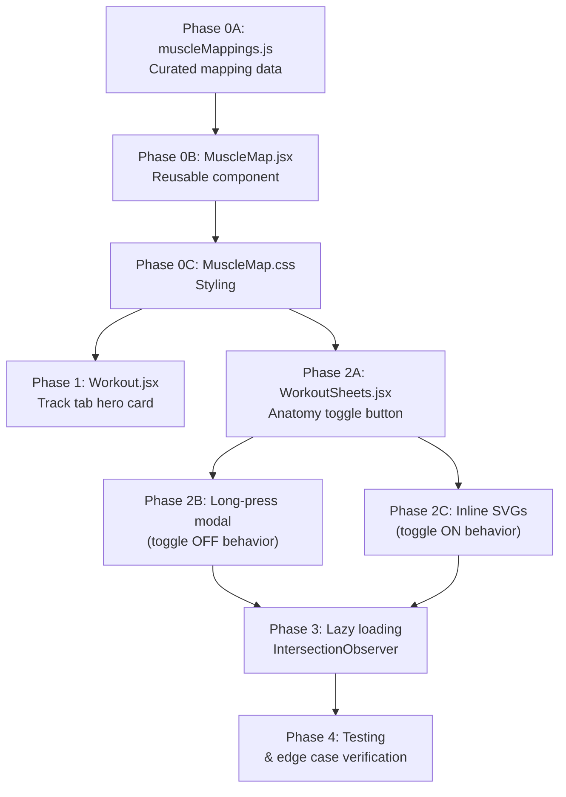

# 🏋️ Muscle Map Integration — Masterplan

---

## Refined Requirements

This section captures the exact requirements as understood after the design interview, distilling the user's intent with all clarifications resolved.

### Requirement 1: Track Tab — Today's Muscle Summary

**What**: A static SVG muscle map displayed as a **hero card at the very top** of the Track tab (above the exercise list), showing a combined visual of all muscle groups targeted by today's scheduled exercises.

**Specifics**:
- Aggregates muscles from *all* exercises in today's routine into a single visualization
- Uses **two-tone highlighting**: red/orange for primary target muscles, light blue for secondary/supporting muscles
- Non-targeted muscles shown as a subtle light-gray body outline
- **Smart view selection**: if today's exercises only target front muscles → show front SVG only; only back muscles → back only; mixed → both side-by-side
- On **rest days** (no exercises scheduled), the muscle map card is hidden entirely
- For routines composed entirely of cardio/fullbody exercises → show an unhighlighted silhouette labeled "Full Body"

### Requirement 2: Exercise Catalog — Muscle Preview on Interaction

**Context**: When the user is building a workout routine (inside the "New Sheet" editor modal) and opens the exercise catalog to add exercises.

**Behavior depends on the Anatomy Toggle** (see Requirement 3):

- **Toggle OFF (default)**: The catalog looks normal. A **long-press** (smartphone touch-hold ~500ms) on any exercise card opens a **bottom-sheet modal** showing:
  - Exercise name and muscle group text
  - Front + back SVG anatomy views (always both, stacked vertically) with the exercise's muscles highlighted
  - The exercise's function description
  - Form tips from the exercise data
  - A close button
  - A regular short tap still toggles the exercise in/out of the sheet as normal

- **Toggle ON**: The catalog cards each display a **small inline SVG** below the exercise name showing the highlighted muscles for that exercise. In this mode:
  - No long-press modal (the anatomy info is already visible)
  - A regular tap selects/deselects the exercise — when selected, the card background turns green and the SVG's primary muscles turn **red** (to contrast with the green background)
  - The inline SVG uses **smart view selection**: only the relevant view(s) appear (front-only, back-only, or both stacked vertically), keeping cards compact

### Requirement 3: Anatomy Toggle in Sheet Editor

**What**: An **icon-only toggle button** placed in the Sheet Editor modal's exercise section header, at the **rightmost position** next to the "Exercises (N)" label.

**Design**:
- Small anatomy/body icon that toggles on/off
- OFF state: icon in muted/tertiary color, no background
- ON state: icon in accent color with subtle background highlight
- Controls two behaviors simultaneously:
  1. Whether inline SVGs appear in exercise catalog cards (Requirement 2 toggle ON)
  2. Whether long-press opens the muscle preview modal (Requirement 2 toggle OFF)
- State is **ephemeral** — resets when the modal closes, no persistence needed

### Visual Style

- **Clean minimal outline style** — a light body silhouette with subtle outlines, colored fills only for active muscles
- Matches the app's existing "Pure Light Monochrome Neo-Brutalist" theme (light backgrounds, solid borders, clean whites)
- **Primary muscles**: red/orange (`#ef4444`)
- **Secondary muscles**: light blue (`#93c5fd`)
- **Idle muscles**: light gray (`#e5e5e5`)
- **Outlines**: subtle gray (`#d4d4d4`)

### Data Accuracy

- Exercise-to-muscle mappings will be **manually curated** for each of the 50+ exercises (not auto-generated from the potentially inaccurate `muscle` field in the exercise data)
- Each mapping specifies exact SVG path IDs for primary and secondary muscles
- The mapping file will be presented for user review before building the UI features

### Performance

- SVG computations only happen when the exercise catalog is opened — no work done while it's closed
- Only render SVGs for cards currently visible in the viewport (IntersectionObserver)
- Cards scrolling into view may briefly show a loading placeholder (spinner/shimmer) before the SVG renders
- Once rendered, SVGs are memoized in memory for the session duration
- Memory is freed when the catalog modal is closed (components unmount)

---

## Phase 0: Foundation — Data & Components

### 0A. Curated Exercise → Muscle Path Mapping

Create `src/data/muscleMappings.js` — a manually curated mapping from each exercise ID to specific SVG path IDs, split into **primary** and **secondary** targets.

```javascript
// Example structure
export const muscleMappings = {
  squat: {
    primary: ['rectus_femoris', 'vastus_lateralis', 'vastus_medialis', 'gluteus_maximus'],
    secondary: ['erector_spinae', 'rectus_abdominis', 'gastrocnemius'],
    views: ['front', 'back']  // which views are relevant
  },
  bench: {
    primary: ['pectoralis_major', 'pectoralis_minor'],
    secondary: ['deltoid_anterior', 'triceps_lateral_long'],
    views: ['front']
  },
  // ... all 50+ exercises
};
```

> [!IMPORTANT]
> - Every exercise in `workouts.js` must have an entry
> - Exercises with `muscleGroup: 'fullbody'`, `'cardio'`, or `'mobility'` get `primary: []` and `secondary: []` — rendered as unhighlighted silhouette with "Full Body" label
> - The `views` array determines which SVG(s) render: `['front']`, `['back']`, or `['front', 'back']`
> - Path IDs must match the SVG `<path id="...">` attributes exactly

### 0B. Reusable `<MuscleMap />` React Component

Create `src/components/MuscleMap.jsx` — a single reusable component that renders the anatomy SVG.

**Props:**

| Prop | Type | Description |
|------|------|-------------|
| `exerciseIds` | `string[]` | Array of exercise IDs to highlight (aggregates all their muscle paths) |
| `view` | `'front' \| 'back' \| 'auto'` | Which view to render. `'auto'` = smart view based on exercise targets |
| `size` | `'sm' \| 'md' \| 'lg'` | Controls SVG dimensions |
| `primaryColor` | `string` | Fill color for primary muscles (default: `#ef4444` red) |
| `secondaryColor` | `string` | Fill color for secondary muscles (default: `#93c5fd` light blue) |
| `idleColor` | `string` | Fill for non-targeted muscles (default: `#e5e5e5` light gray) |
| `outlineColor` | `string` | Stroke color for all paths (default: `#d4d4d4`) |
| `showLabel` | `boolean` | Show "Full Body" label for unmapped exercises |
| `className` | `string` | Additional CSS class |

**Key behaviors:**
- Accepts multiple `exerciseIds` and **unions** all their primary/secondary muscles
- When multiple exercises share a muscle, it stays primary-colored (primary wins over secondary)
- Smart `view='auto'` logic:
  - If all muscles are front-only → render front only
  - If all muscles are back-only → render back only
  - If mixed → render **both vertically** (front above back)
- Exercises with empty mappings → full silhouette + "Full Body" text centered below

### 0C. Muscle Map CSS

Create `src/components/MuscleMap.css`

```css
/* Size variants */
.muscle-map--sm svg { width: 64px; height: auto; }
.muscle-map--md svg { width: 100px; height: auto; }
.muscle-map--lg svg { width: 140px; height: auto; }

/* Path styling */
.muscle-map path { transition: fill 0.2s ease; }

/* "Full Body" label */
.muscle-map__label {
  font-size: 10px;
  font-weight: 700;
  text-transform: uppercase;
  letter-spacing: 0.06em;
  color: var(--text-tertiary);
  text-align: center;
  margin-top: 4px;
}
```

---

## Phase 1: Track Tab — Today's Muscle Summary

**File:** `src/pages/Workout.jsx`

### What to build

A hero-style card at the **top of the page** (above the exercise list, below the header) showing a combined muscle map of all exercises scheduled for today.

### Implementation

1. **Placement**: Insert between the header (Line ~281) and the section header "Exercises" (Line ~326)
2. **Rendering**:
   - Collect all `exerciseId`s from `template.exercises`
   - Pass them to `<MuscleMap exerciseIds={[...]} view="auto" size="lg" />`
   - The component unions all muscles and renders the combined view
3. **Card design**:
   ```
   ┌─────────────────────────────────┐
   │  TODAY'S TARGET MUSCLES         │
   │                                 │
   │     [Front SVG]  [Back SVG]     │
   │                                 │
   │  ● 4 primary  ○ 3 secondary    │
   └─────────────────────────────────┘
   ```
   - Card with `var(--bg-card)` background, border `var(--border)`, border-radius `var(--radius-lg)`
   - Section label "TODAY'S TARGET MUSCLES" in small uppercase
   - SVGs centered, side-by-side if both views needed
   - Small legend below: colored dots showing "X primary · Y secondary" count

### Edge cases

| Case | Behavior |
|------|----------|
| Rest day (no exercises) | Don't render the muscle map card at all |
| All exercises are cardio/fullbody | Show unhighlighted silhouette with "Full Body" label |
| Only front muscles today | Show front SVG only (centered) |
| Only back muscles today | Show back SVG only (centered) |
| Mixed front + back | Show both side-by-side |

---

## Phase 2: Exercise Catalog — Long-Press Modal & Inline SVG

**File:** `src/pages/WorkoutSheets.jsx`

### 2A. Anatomy Toggle Button

**Location**: Sheet Editor modal, in the exercises section header (Line ~904), rightmost position next to `"Exercises (N)"`.

**Design**: Icon-only toggle — a small body/anatomy icon (use the `Body` icon from lucide-react, or a custom SVG silhouette icon).

```
┌──────────────────────────────────────┐
│ Exercises (3)           [⚡] [🦴]   │
│                    Optimize  Anatomy │
└──────────────────────────────────────┘
```

- **OFF state**: Icon in `var(--text-tertiary)`, no background
- **ON state**: Icon in `var(--accent)` or themed color, subtle background highlight
- State: `const [anatomyMode, setAnatomyMode] = useState(false);`
- This state controls both the inline SVG rendering AND the long-press behavior

### 2B. Behavior When Toggle is OFF (Long-Press Modal)

When `anatomyMode === false` and the user **long-presses** an exercise card in the catalog:

1. **Long-press detection**: Add `onTouchStart` / `onTouchEnd` handlers with a 500ms timer
2. **Modal content**:
   ```
   ┌─────────────────────────────────┐
   │         Barbell Back Squat      │
   │         Legs, Core, Back        │
   │                                 │
   │     [Front SVG]                 │
   │     [Back SVG]                  │
   │                                 │
   │  Function                       │
   │  Knee extension and hip flexion │
   │                                 │
   │  Form Tips                      │
   │  • White-knuckle the bar...     │
   │  • Squeeze glutes at top...     │
   │                                 │
   │         [ Close ]               │
   └─────────────────────────────────┘
   ```
3. **SVG rendering**: `<MuscleMap exerciseIds={[exerciseId]} view="auto" size="lg" />`
4. **Both front + back always shown**, stacked vertically in the modal
5. **Modal uses the existing `<Modal>` component** with `type="bottom-sheet"`

**State additions:**
```javascript
const [longPressExercise, setLongPressExercise] = useState(null);
const longPressTimerRef = useRef(null);
```

### 2C. Behavior When Toggle is ON (Inline SVG in Cards)

When `anatomyMode === true`, the exercise catalog cards show the muscle map **inline**:

```
┌─────────────────────────────────────┐
│ ✓  Barbell Back Squat              │  ← Green bg when selected
│    Legs · Strength                  │
│    ┌───────────┐                    │
│    │ [Front]   │  ← Small SVG      │
│    │  (red     │     primary = red  │
│    │   fills)  │     on green card  │
│    └───────────┘                    │
│    ┌───────────┐                    │
│    │ [Back]    │  ← Only if needed  │
│    └───────────┘                    │
└─────────────────────────────────────┘
```

**Key details:**
- SVG placed **below the exercise name**, inside each catalog card
- Size: `sm` (64px width) — compact enough to fit in the card
- **Smart view**: only the relevant view(s) show — front-only, back-only, or both vertically
- **When card is selected (green bg)**:
  - Card background: `#f0fdf4` (existing green)
  - Primary muscle fill: **red** (`#ef4444`) — stands out on green
  - Secondary muscle fill: lighter red/pink (`#fca5a5`)
  - Idle muscle fill: slightly darker to contrast on green bg (`#d1d5db`)
- **When card is unselected**:
  - Primary muscle fill: default red (`#ef4444`)
  - Secondary muscle fill: default blue (`#93c5fd`)
  - Idle muscle fill: light gray (`#e5e5e5`)
- **No long-press modal** when toggle is ON (the SVG is already visible)

### Performance: Lazy Rendering with Intersection Observer

> [!IMPORTANT]
> The catalog has 50+ exercises. Rendering 50+ inline SVGs is expensive.

**Strategy:**
1. **SVGs only load when `showCatalog` is true** — no computation when catalog is closed
2. **Intersection Observer**: Only render `<MuscleMap>` for cards currently visible in the viewport
3. **Placeholder**: Cards outside the viewport show a small skeleton shimmer (same height as the SVG)
4. **Memoization**: `React.memo` the `<MuscleMap>` component with props comparison — once rendered, the SVG stays in memory for the session
5. **Cleanup**: When catalog closes (`showCatalog = false`), the components unmount naturally (React handles this)

**Implementation:**

```javascript
// Lightweight wrapper for lazy SVG loading
function LazyMuscleMap({ exerciseId, ...props }) {
  const ref = useRef(null);
  const [visible, setVisible] = useState(false);

  useEffect(() => {
    const observer = new IntersectionObserver(
      ([entry]) => { if (entry.isIntersecting) setVisible(true); },
      { rootMargin: '100px' }  // pre-load 100px before visible
    );
    if (ref.current) observer.observe(ref.current);
    return () => observer.disconnect();
  }, []);

  return (
    <div ref={ref} style={{ minHeight: props.size === 'sm' ? 80 : 120 }}>
      {visible ? <MuscleMap exerciseIds={[exerciseId]} {...props} /> : <SkeletonShimmer />}
    </div>
  );
}
```

---

## Phase 3: Implementation Order & File Changes

### Files to create (new)

| File | Purpose |
|------|---------|
| `src/data/muscleMappings.js` | Curated exercise → SVG path mapping |
| `src/components/MuscleMap.jsx` | Reusable SVG muscle map component |
| `src/components/MuscleMap.css` | Styles for the muscle map component |

### Files to modify (existing)

| File | Changes |
|------|---------|
| `src/pages/Workout.jsx` | Add hero muscle map card at top of Track tab |
| `src/pages/WorkoutSheets.jsx` | Add anatomy toggle, long-press modal, inline SVGs in catalog cards |
| `src/pages/Workout.css` | Add `.muscle-hero-card` styles |

### Implementation order



---

## Edge Cases & Error Handling

| Edge Case | Handling |
|-----------|----------|
| **Exercise not in mapping** | Falls back to `primary: [], secondary: []` → shows unhighlighted silhouette with "Full Body" label |
| **Legacy exercise ID** (alias) | The existing Proxy in `Workout.jsx` resolves aliases before we look up the mapping |
| **SVG path ID mismatch** | Silently skip missing paths (no crash). Console.warn in dev mode |
| **Rest day** (no exercises) | Don't render muscle map card in Track tab |
| **All exercises are cardio/mobility** | Show full silhouette + "Full Body" label |
| **Very long exercise list** (15+ exercises) | Union of all muscles may highlight almost everything — that's correct behavior, shows "it's a full body day" |
| **Toggle state persistence** | `anatomyMode` is local state, resets when modal closes — no persistence needed |
| **Long-press conflicts with scroll** | Cancel long-press timer if `touchmove` event fires (prevents accidental triggers while scrolling) |
| **Dark mode** (if ever added) | CSS custom properties in `MuscleMap.css` should use `var()` tokens so it adapts |
| **Performance on low-end phones** | IntersectionObserver + loading spinner + React.memo ensures only visible SVGs render |
| **Rapid toggle on/off** | Toggle state change triggers re-render; SVGs mount/unmount cleanly |

---

## Visual Summary

````carousel
### Track Tab — Hero Muscle Map
```
┌─ Track ──────────────────────────┐
│  CNS Strength Blueprint          │
│  Monday, July 21                 │
│                                  │
│ ┌──────────────────────────────┐ │
│ │  TODAY'S TARGET MUSCLES      │ │
│ │                              │ │
│ │   🧍 Front    🧍 Back       │ │
│ │   (red/blue   (red/blue     │ │
│ │    fills)      fills)        │ │
│ │                              │ │
│ │  ● 6 primary  ○ 4 secondary │ │
│ └──────────────────────────────┘ │
│                                  │
│  Exercises                       │
│ ┌──────────────────────────────┐ │
│ │ ○  Squat  3×5 · 100kg    ▼  │ │
│ ├──────────────────────────────┤ │
│ │ ○  Bench  3×5 · 80kg     ▼  │ │
│ └──────────────────────────────┘ │
└──────────────────────────────────┘
```
<!-- slide -->
### Exercise Catalog — Toggle OFF (Long-Press)
```
┌─ Add Exercise ────────── 🔍 ─────┐
│                                   │
│ ┌───────────────────────────────┐ │
│ │ ✓  Barbell Back Squat         │ │
│ │    Legs · Strength            │ │
│ └───────────────────────────────┘ │
│ ┌───────────────────────────────┐ │
│ │    Bench Press                │◀── Long press
│ │    Chest · Strength           │   triggers modal
│ └───────────────────────────────┘ │
│                                   │
│ ┌── Modal ─────────────────────┐  │
│ │  Bench Press                 │  │
│ │  Chest, Shoulders, Triceps   │  │
│ │                              │  │
│ │  🧍 Front   🧍 Back         │  │
│ │                              │  │
│ │  Function: Shoulder flexion  │  │
│ │  Tips: • Arch back slightly  │  │
│ │        • Squeeze at top      │  │
│ └──────────────────────────────┘  │
└───────────────────────────────────┘
```
<!-- slide -->
### Exercise Catalog — Toggle ON (Inline SVGs)
```
┌─ Add Exercise ───── 🔍  🦴(on) ─┐
│                                   │
│ ┌───────────────────────────────┐ │
│ │ ✓  Barbell Back Squat    ✓   │ │  ← Green bg
│ │    Legs · Strength           │ │
│ │    ┌─────────┐               │ │
│ │    │ 🧍Front │ red muscles   │ │
│ │    └─────────┘               │ │
│ │    ┌─────────┐               │ │
│ │    │ 🧍Back  │               │ │
│ │    └─────────┘               │ │
│ └───────────────────────────────┘ │
│ ┌───────────────────────────────┐ │
│ │    Bench Press               │ │  ← Default bg
│ │    Chest · Strength          │ │
│ │    ┌─────────┐               │ │
│ │    │ 🧍Front │ red muscles   │ │
│ │    └─────────┘               │ │
│ └───────────────────────────────┘ │
└───────────────────────────────────┘
```
````

---

## Estimated Effort

| Phase | Effort | Description |
|-------|--------|-------------|
| 0A | Medium | Curate 50+ exercise mappings (needs review) |
| 0B–0C | Medium | Build `MuscleMap` component + CSS |
| 1 | Small | Track tab hero card (mostly wiring) |
| 2A | Small | Anatomy toggle button |
| 2B | Medium | Long-press detection + modal |
| 2C | Medium | Inline SVGs + selection colors |
| 3 | Small | Lazy loading / IntersectionObserver |
| **Total** | **~4–5 hours** | |

---

> [!TIP]
> After Phase 0A (the mapping file), you should review it before we proceed. The accuracy of every muscle highlight depends on this mapping being correct.
